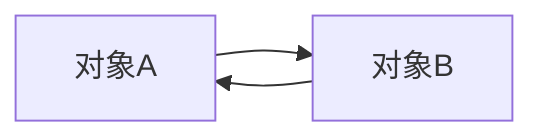
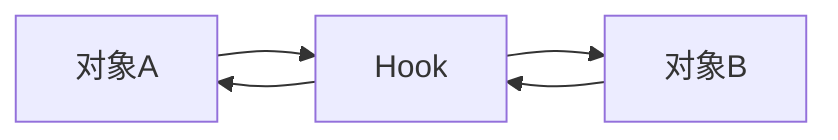

## 第14章 Hook技术

### 1 Hook技术概述

Android系统的代码调用和回调是按照一定的顺序执行的，举个简单的例子，如下图：



上图中，对象A调用类对象，对象B处理后将数据回调给对象A，接着来看采用Hook的调用流程，如下图：



上图中，Hook可以是一个方法或者一个对象，它像一个钩子一样挂载对象A和对象B之前，当对象A调用对象B之前可以做一些修改。

Hook技术可以在进程间进行行为更改。Hook可以将自己融入到它所要劫持的对象所在的进程中。被劫持的对象，称作**Hook点**，为了保证Hook的稳定性，Hook点一般选择**容易找到并且不易变化的对象，静态变量和单例**就符合这一条件。

***

### 2 Hook技术分类

根据Hook的API语言划分，分为Hook Java和Hook Native。

* **Hook Java**主要通过反射和代理来实现，应用于在SDK开发环境中修改Java代码。
* **Hook Native**则应用于在NDK开发环境和系统开发中修改Native代码。

根据Hook的进程划分，分为应用程序进程Hook和全局Hook。

* **应用程序进程Hook**只能Hook当前所在的应用程序进程。
* 应用程序进程是Zygote进程fock出来的，如果对Zygote进行Hook，就可以实现Hook系统所有的应用程序进程，这就是**全局Hook**。

根据Hook的实现方式划分，分为以下两种。

* 通过反射和代理实现，只能Hook当前的应用程序进程。
* 通过Hook框架来实现，比如Xposed，可以实现全局Hook，但是需要root。

***

### 3 代理模式

[代理模式](https://github.com/NieJianJian/AndroidNotes/blob/master/Java/代理模式.md)

***

### 4 Hook startActivity方法

Hook可以用来劫持对象，被劫持的对象叫做Hook点，用代理对象来代替Hook点，这样就可以在代理上实现自己想做的操作。这里以Hook常用的`startActivity`方法来举例，`startActivity`方法分为以下两个：

```java
startActivity(intent);
getApplicationContext().startActivity(intent);
```

第一个是Activity的`startActivity`方法，第二个是Context的`startActivity`方法，两个方法的调用链不同。

### 4.1 Hook Activity的startActivity方法

* Activity的`satrtActivity`方法，代码如下：

  ```java
  public void startActivity(Intent intent) {
      this.startActivity(intent, null);
  }
  ```

* 随后调用到了`startActivityForResult`方法中，该方法中有如下一行代码：

  ```java
  mInstrumentation.execStartActivity(
          this, mMainThread.getApplicationThread(), mToken, this,
          intent, requestCode, options);
  ```

* `mInstrumentaion`是Activity的成员变量，我们选择Instrumentaion为Hook点，用代理Instrumentaion来代替原始的Instrumentation来完成Hook。代理Instrumentaion类代码如下：

  ```java
  class InstrumentationProxy extends Instrumentation {
      public static final String TAG = "InstrumentationProxy";
      public Instrumentation mInstrumentation;
      public InstrumentationProxy(Instrumentation instrumentation) {
          mInstrumentation = mInstrumentation;
      }
      public ActivityResult execStartActivity(
              Context who, IBinder contextThread, IBinder token, Activity target,
              Intent intent, int requestCode, Bundle options) {
          Log.d(TAG, "Hook成功" + "---who:" + who);
          try {
              // 通过反射找到Instrumentation的execStartActivity方法
              Method execStartActivity = Instrumentation.class.getDeclaredMethod(
                      "execStartActivity",
                      Context.class, IBinder.class, IBinder.class, Activity.class,
                      Intent.class, int.class, Bundle.class);
              execStartActivity.setAccessible(true);
              return (ActivityResult) execStartActivity.invoke(mInstrumentation, who,
                      contextThread, token, target, intent, requestCode, options);
          } catch (Exception e) {
              throw new RuntimeException(e);
          }
      }
  }
  ```

  InstrumentationProxy的`execStartActivity`方法的内部，通过反射找到并调用了Instrumentation的`execStartActivity`方法。

* 接下来，我们用InstrumentationProxy来替换Instrumentation，MainActivity中代码如下：

  ```java
  public void replaceActivityInstrumentation(Activity activity) {
      try {
          Field field = Activity.class.getDeclaredField("mInstrumentation"); // 1
          field.setAccessible(true); // 2
          Instrumentation instrumentation = (Instrumentation) field.get(activity); // 3
          Instrumentation instrumentationProxy = new InstrumentationProxy(
                  instrumentation); // 4
          field.set(activity, instrumentationProxy); // 5
      } catch (Exception e) {
          e.printStackTrace();
      }
  }
  ```

  * 注释1处得到Activity的成员变量`mInstrumentation`。
  * 注释2处取消Java的权限控制检查，因为该变量是私有的。
  * 注释3处得到Activity中Instrumentation对象
  * 注释4处创建InstrumentationProxy并传入注释3处得到的Instrumentation对象
  * 注释5处用InstrumentationProxy来替换Instrumentation。

* 最后在MainActivity的`onCreate`方法中使用`replaceActivityInstrumentation`方法，如下所示：

  ```java
  @Override
  protected void onCreate(Bundle savedInstanceState) {
      super.onCreate(savedInstanceState);
      setContentView(R.layout.activity_main);
      replaceActivityInstrumentation(this);
      Intent intent = new Intent(Intent.ACTION_VIEW);
      intent.setData(Uri.parse("http://www.baidu.com"));
      startActivity(intent);
  }
  ```

到此就hook成功了。

### 4.2 Hook Context的startActivity方法

Context的实现类为ContextImpl，ContextImpl的`startActivity`方法如下：

```java
public void startActivity(Intent intent, Bundle options) {
    ...
    mMainThread.getInstrumentation().execStartActivity(
            getOuterContext(), mMainThread.getApplicationThread(), null,
            (Activity) null, intent, -1, options);
}
```

代码中通过ActivityThread的`getInstrumentation`方法获取Instrumentation。ActivityThread是主线程的管理类，Instrumentation是ActivityThread的成员变量，一个进程只有一个ActivityThread，因此仍旧选择Instrumentation作为Hook点。

* 用之前写好的InstrumentationProxy来替换掉Instrumentation，代码如下：

  ```java
  public void replaceContextInstrumentation() {
      try {
          Class<?> activityThreadClazz = Class.forName("android.app.ActivityThread");
          Field activityThreadField = activityThreadClazz.getDeclaredField(
                  "sCurrentActivityThread"); // 1
          activityThreadField.setAccessible(true);
          Object currentActivityThread = activityThreadField.get(null); // 2
          Field mInstrumentationField = activityThreadClazz.getDeclaredField(
                  "mInstrumentation");
          mInstrumentationField.setAccessible(true);
          Instrumentation mInstrumentation = (Instrumentation) mInstrumentationField
                  .get(currentActivityThread);
          Instrumentation mInstrumentationProxy = new InstrumentationProxy(
                  mInstrumentation); // 3
          mInstrumentationField.set(currentActivityThread, mInstrumentationProxy);
      } catch (Exception e) {
          e.printStackTrace();
      }
  }
  ```

  * 通过反射获取ActivityThread类，ActivityThread类中有一个静态变量`sCurrentActivityThread`，用于表示当前ActivityThread对象。
  * 注释1处获取`sCurrentActivityThread`字段
  * 注释2处获取Field类型的`activityThreadField`对象的值，这个值就是`sCurrentActivityTrehad`对象。
  * 获取当前ActivityThread的`mInstrumentation`对象。
  * 创建InstrumentationProxy并传入此前得到的Instrumentation对象
  * 最后用InstrumentationProxy来替换Instrumentation。

* 最后再MainActivity的`onCreate`方法中使用`replaceContextInstrumentation`方法，如下所示：

  ```java
  @Override
  protected void onCreate(Bundle savedInstanceState) {
      super.onCreate(savedInstanceState);
      setContentView(R.layout.activity_main);
      replaceContextInstrumentation();
      Intent intent = new Intent(Intent.ACTION_VIEW);
      intent.setData(Uri.parse("http://www.baidu.com"));
      intent.addFlags(Intent.FLAG_ACTIVITY_NEW_TASK);
      getApplicationContext().startActivity(intent);
  }
  ```

到此就hook成功了。